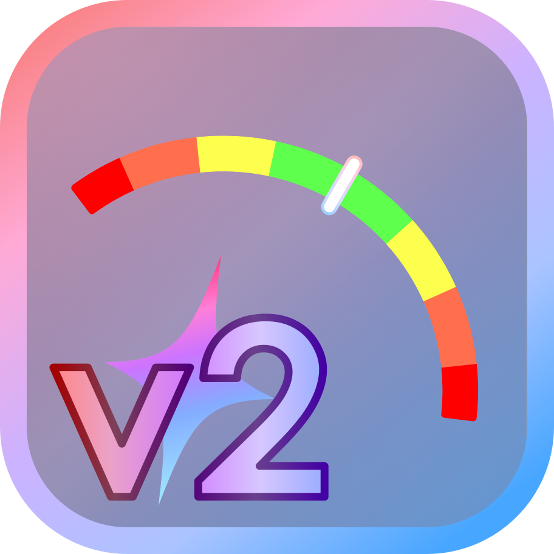
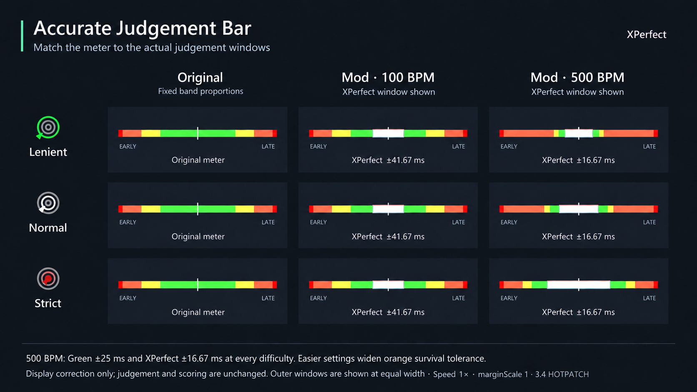

#  Accurate Judgement Bar v2

You can still submit clears to TUF as usual while using this mod.

<small>v2.0.0 requires game version 3.4.0 or later and Unity Mod Manager (UMM) 0.27.0 or later. No separate installation of XPerfect is required.</small>

## Accurate Judgement Bar Rendering
Adds an **XPerfect window** to the judgement bar and dynamically adjusts each colored band's width based on **BPM, judgement difficulty, and playback speed**.

The original judgement bar uses a static image, but actual judgements have **minimum timing windows**, measured in milliseconds. As BPM increases, different judgements reach their minimums at different points, changing the proportions between their windows. This feature redraws the bar to accurately reflect the current judgement windows.
<small>This feature only corrects the display; it does not change the actual judgement or scoring rules.</small>

## Other Features

* Lets you customize certain judgement bar details
* Displays **Overload HP** (remaining HP before dying from too many extra key presses)
* Allows **Strict Judgement** to be enabled in all levels
* Shows the Miss / Too Early judgement windows after your first death
* Offers an option to use the legacy hit marker appearance
* Includes a solid white display option that hides the XPerfect marker outline
